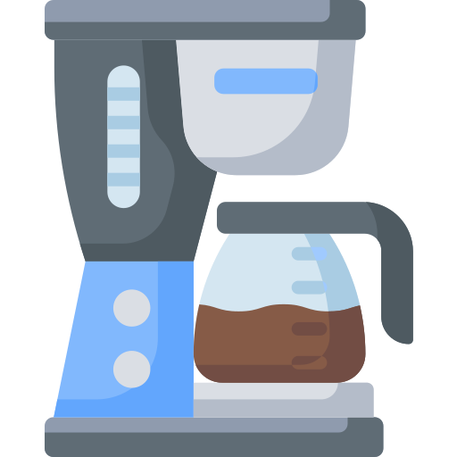
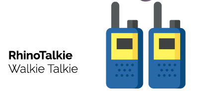
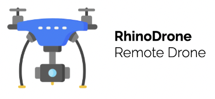
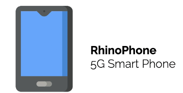
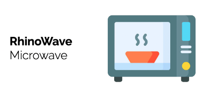

# Return Ready Lab 17

* Part A - Foundations 7.3
* Part B - Foundations 7.4
* Part C - Instructor Challenge 

## Part A

### Example and Activity 01

#### Step 01

In the package `lab17.part_a.examples` look at the file `Example01_ConstructorExample` and write comments for each line of code. When complete review with instructor.

#### Step 02

In the package `labs.lab17.part_a.activity` complete the `Activity01_Constructor` per the following:

* Create a program with an empty string called name
* Create a constructor for the class that prints a line stating that the constructor is being called.
* Ensure that you are also re-assigning the name string to your own name within the constructor
* Inside of the main method, create an instance of the class that has the constructor
* Accessing the name variable inside of the newly created instance (. operator) print out the name

Your program is working correctly, if when run, the following is the output (Abe first name Lincoln last name):

```
The constructor is being called:
The name is Francis

```

> Use Example01_ConstructorExample for reference.

## Part B

### Example and Activity 01

#### Step 01

In the package `lab17.part_a.examples` look at the file `Example01_EmptyMethodExample` and write comments for each line of code. When complete review with instructor.

#### Step 02

In the package `labs.lab17.part_a.activity` complete the `Activity01_Method` per the following:

* Create a program with a method (outside of the main method) that asks two questions, saves each user response, and eventually prints it back out to the user.
* Call the question method inside of the main method.

Your program is working correctly, if when run, the following is the output (Abe first name Lincoln last name):

```
What's your first name?
Stephanie
And how old are you Stephanie?
28
Gio I see that you're 28 years old.

```

> Use Example01_EmptyMethodExample for reference.

### Example and Activity 02

#### Step 01

In the package `lab14.part_a.examples` look at the file `Example02_LoopPrint` and write comments for each line of code. When complete review with instructor.

#### Step 02

In the package `labs.lab14.part_a.activity` complete the `Activity02_FixThisLoop` per the following:

* Create a program that has two different parameterized methods - outside of the main method
* One method should perform multiplication on two numbers and the other method should perform division on two numbers 
	* Both should return the correct mathematical result
* Call each method inside of the main method and print out the results

Your program is working correctly, if when run, the following is the output:

```
multiplication result: 10
division result: 2.5
```

> Use Example02_MethodWithParameters for reference.


### Example and Activity 03

#### Step 01

In the package `lab17.part_a.examples` look at the file `Example03_OverloadingMethod` and write comments for each line of code. When complete review with instructor.

#### Step 02

In the package `labs.lab17.part_a.activity` complete the `Activity03_MethodOverload` per the following:

* Create a program that has two methods outside of the main method
* The first method should take in a character and a number and then print out a sentence containing each
* Overload that method so that it takes in a number and then a character - print out that sentence containing each
* Call both methods inside of the main method to see the result

Your program is working correctly, if when run, the following is the output:

```
First I print the character a and then the number 2
First I print the number y and then the character 1
```

> Use Example03_MethodOverload for reference.

## Part C - TDD Electronics

In this lab you are going to design classes to represent abstractions of the electronics listed below.

### Example Coffee Maker

 

### Step 01 create the UML

### Camera


### Printer


### Radio


### TV


### Remote


### WalkieTalkie


### Robot


### Drone


### Phone


### Microwave


### Game Console
